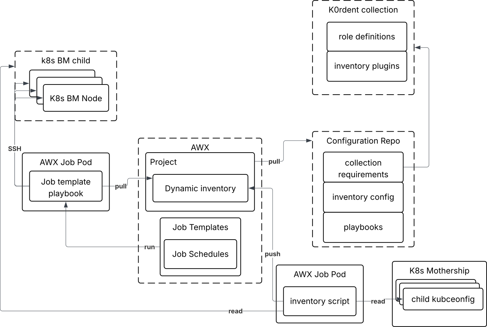
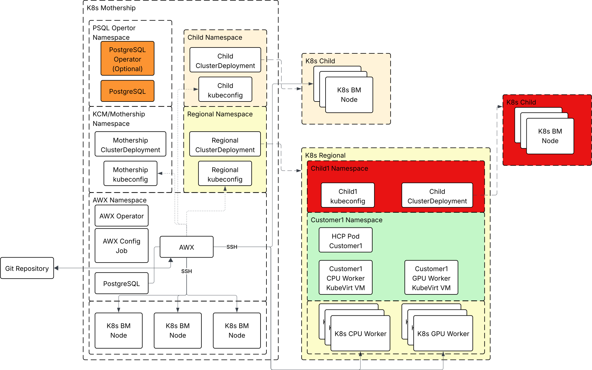
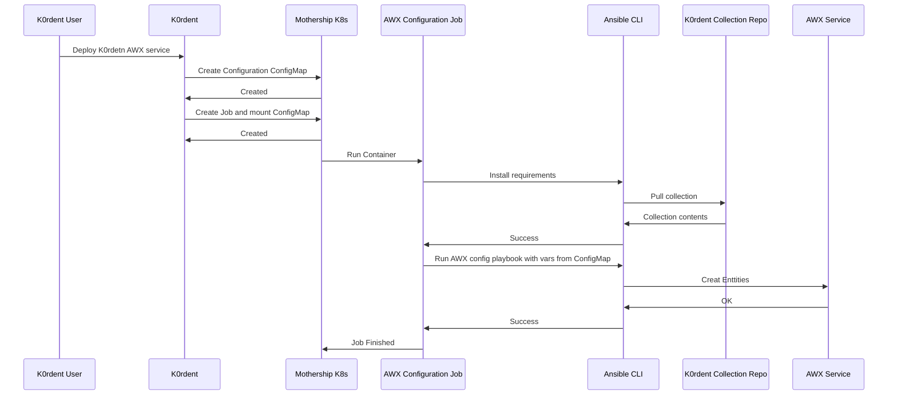

# Architecture

## Overview

This document describes the architecture of the AWX service for K0rdent.

## Components
- K0rdent Cluster
- AWX Service
- Ansible Collection for K0rdent
  - Dynamic Inventory for K0rdent Child Clusters
  - Ansible playbooks and roles for AWX Service Configuration
  - Ansible roles for K0rdent Child Clusters Configuration
- Configuration Repository with user defined configurations for nodes in the inventory

### High Level Diagram

### Service Diagram

## Deployment Flow
